# 🔬 Named Parameters Operators — Proof of Concept

**Date:** January 17, 2026 (4+ hours intensive work)  
**Author:** Utkarsh Khajuria  
**Purpose:** Validate understanding of Efi's Named Parameters architecture and identify integration challenges

---

## 📌 Executive Summary

This proof-of-concept demonstrates understanding of CGAL's operator-based Named Parameters system by:

| # | Accomplishment | Status |
|---|----------------|--------|
| 1 | Creating 3 reference operator implementations | ✅ Done |
| 2 | Implementing 2 operators in actual cgal-python-bindings codebase | ✅ Done |
| 3 | Attempting full integration with `compute_vertex_normals()` | ✅ Done |
| 4 | **Discovering the REAL challenge: Property map type resolution** | 🎯 Found |
| 5 | Documenting findings for Jan 23 email to Efi | ✅ Done |

> **Key Discovery:** Operators themselves are trivial (30 lines, 30 min). The 2-week allocation is for solving the **property map type bridge** between Python and C++.

---

## 📋 Table of Contents

- [What Was Implemented](#-what-was-implemented)
- [The Critical Challenge Discovered](#-the-critical-challenge-discovered)
- [Why This Discovery is Valuable](#-why-this-discovery-is-valuable)
- [File Structure](#-file-structure)
- [Implementation Details](#-implementation-details)
- [The Property Map Problem](#-the-property-map-problem)
- [Four Potential Solutions](#-four-potential-solutions)
- [Actual Integration Attempt](#-actual-integration-attempt)
- [Compilation Error Analysis](#-compilation-error-analysis)
- [Questions for Efi](#-questions-for-efi)
- [What This Demonstrates](#-what-this-demonstrates)
- [Next Steps](#-next-steps)

---

## ✅ What Was Implemented

### Reference Implementations (This Folder)

Created 3 operators demonstrating all major patterns:

| Operator | Pattern | Key Feature | Time |
|----------|---------|-------------|------|
| `Named_parameter_verbose.hpp` | Simple Value | `py::cast<bool>(value)` | ~20 min |
| `Named_parameter_vertex_point_map.hpp` | Property Map ⭐ | Generic handling — **THE CHALLENGE** | ~40 min |
| `Named_parameter_geom_traits.hpp` | Kernel/Traits | `py::cast<const Kernel&>(value)` | ~30 min |

### Actual Implementation (cgal-python-bindings repo)

| Detail | Value |
|--------|-------|
| **Branch** | `feature/named-params-operators-poc` |
| **Commit** | `eb5a9e39` (2 files, 60 lines) |

Created 2 operators following Efi's exact style:
- `src/libs/cgalpy/include/CGALPY/Named_parameter_vertex_point_map.hpp`
- `src/libs/cgalpy/include/CGALPY/Named_parameter_vertex_normal_map.hpp`

Both are **structurally correct** and match Efi's pattern exactly.

---

## 🔴 The Critical Challenge Discovered

### Before vs After Implementation

```mermaid
graph LR
    subgraph Before["❌ Initial Understanding"]
        A["Weeks 7-8 = 15-20 operators<br/>+ 5-7 functions<br/>'Should be straightforward'"]
    end
    
    subgraph After["✅ Reality After Attempt"]
        B["Operators are trivial<br/>(30 lines, 30 min each)"]
        C["Property map type resolution<br/>is THE real challenge"]
        D["2-week allocation<br/>makes total sense now"]
    end
    
    Before --> After
    B --> C --> D
```



### The Compilation Error

When attempting to integrate operators into `compute_vertex_normals()`:

```
error: no type named 'reference' in 'boost::property_traits<nanobind::handle>'
typedef typename boost::property_traits<VertexPointMap>::reference Point_ref;
                 ^~~~~~~~~~~~~~~~~~~~~~~~~~~~~~~~~~~~~~~~~~~~~~~

In file: /opt/homebrew/include/CGAL/Polygon_mesh_processing/compute_normal.h:90:60
```

### What This Means

CGAL's PMP functions internally call:

```cpp
const Point& point = get(vertex_point_map, vertex);
```

This requires:
- `boost::property_traits<VertexPointMap>` must be defined
- Must have `reference` and `value_type` typedefs
- `nanobind::handle` (Python object) doesn't satisfy this

> **The bridge from Python → C++ property maps is the real challenge.**

---

## 💡 Why This Discovery is Valuable

### Demonstrates Deep Understanding

| Evidence | What It Shows |
|----------|---------------|
| ✅ Quickly identified real challenge | Within 1 hour of implementation |
| ✅ Won't waste time on wrong approach | During GSoC Weeks 7-8 |
| ✅ Can discuss solutions intelligently | With Efi |
| ✅ Understands why 2 weeks allocated | For this task |

### Shows Technical Maturity

| Approach | Evaluation |
|----------|------------|
| ❌ Naive | "Just write 20 operators, it's easy" |
| ✅ Mature | "I found the hard part — let me understand it before proceeding" |

### Validates Proposal Understanding

The proposal timeline shows:
- **Weeks 7-8:** Named Parameters (80-90 hours, HIGH complexity)

**This proves why:** Not the operators, but the type resolution system.

---

## 📁 File Structure

```
proof-of-concept-operators/
├── README.md                              # This file
├── PROPERTY_MAP_CHALLENGE.md              # Deep dive into type resolution
├── CMakeLists.txt                         # Reference build (not for compilation)
│
├── include/CGALPY/operators/
│   ├── Named_parameter_verbose.hpp        # Pattern 1: Simple Value
│   ├── Named_parameter_vertex_point_map.hpp   # Pattern 2: Property Map ⭐
│   └── Named_parameter_geom_traits.hpp    # Pattern 3: Kernel/Traits
│
├── src/
│   └── mock_test.cpp                      # Mock test (reference only)
│
└── tests/
    └── test_operators.py                  # Python test structure (reference)
```

> **Note:** Files in this folder are reference documentation only — not meant to be built in prep repo.

---

## 🔧 Implementation Details

### Operator Pattern (All 3 Types)

```cpp
struct Named_parameter_PARAM_NAME {
  const std::string m_name = "param_name";  // Python dict key
  
  template <typename NamedParameters, typename Value>
  auto operator()(NamedParameters& np, Value& value) const {
    // Type casting (varies by pattern)
    return np.param_name(casted_value);  // Chain to CGAL parameters
  }
};
```

### Pattern 1: Simple Value (Boolean/Integer)

```cpp
struct Named_parameter_verbose {
  const std::string m_name = "verbose";
  
  template <typename NamedParameters, typename Value>
  auto operator()(NamedParameters& np, Value& value) const {
    return np.verbose(py::cast<bool>(value));  // ← Explicit cast
  }
};
```

| Characteristic | Value |
|----------------|-------|
| Type casting | Direct |
| Mesh dependency | None |
| Complexity | Lowest |

---

### Pattern 2: Property Map (THE CHALLENGE) 🚨

```cpp
struct Named_parameter_vertex_point_map {
  const std::string m_name = "vertex_point_map";
  
  template <typename NamedParameters, typename Value>
  auto operator()(NamedParameters& np, Value& value) const {
    return np.vertex_point_map(value);  // ← Generic - no cast
  }
};
```

| Characteristic | Value |
|----------------|-------|
| Type casting | None (nanobind should resolve) |
| Mesh dependency | High (Surface_mesh vs Polyhedron_3) |
| Complexity | **THIS IS WHERE IT BREAKS** |

---

### Pattern 3: Kernel/Traits

```cpp
struct Named_parameter_geom_traits {
  const std::string m_name = "geom_traits";
  
  template <typename NamedParameters, typename Value>
  auto operator()(NamedParameters& np, Value& value) const {
    return np.geom_traits(py::cast<const Kernel&>(value));  // ← Cast to Kernel
  }
};
```

| Characteristic | Value |
|----------------|-------|
| Type casting | Explicit kernel |
| Mesh dependency | None (single type) |
| Complexity | Already implemented by Efi ✅ |

---

## 🔴 The Property Map Problem

### The Gap Between Python and C++

```mermaid
graph TD
    subgraph Python["🐍 Python Side"]
        P1["vpm = mesh.points()"]
        P2["Returns Python object"]
    end
    
    subgraph CPP["🔧 C++ Side"]
        C1["Value& value = nanobind::handle"]
        C2["CGAL calls: get(value, vertex)"]
        C3["Requires: boost::property_traits<Value>"]
    end
    
    subgraph Error["❌ The Problem"]
        E["No boost::property_traits<nanobind::handle>!"]
    end
    
    P1 --> P2
    P2 --> C1
    C1 --> C2
    C2 --> C3
    C3 --> E
```



### What CGAL Expects

```cpp
// Surface_mesh
using Vd = Surface_mesh::Vertex_index;
using Vpm = Surface_mesh::Property_map<Vd, Point_3>;

Vpm vpm = mesh.points();
const Point_3& p = get(vpm, vertex);  // Requires boost::property_traits<Vpm>
```

### What Python Provides

```python
vpm = mesh.points()  # Returns some Python object
PMP.compute_vertex_normals(mesh, vnormals, {"vertex_point_map": vpm})
```

### The Gap

```cpp
// In C++ binding
Value& value;  // This is nanobind::handle (Python object)

// CGAL internally does:
auto p = get(value, vertex);  // ❌ FAILS!
// Error: no boost::property_traits<nanobind::handle>
```

### Why It's Hard

Property map types are mesh-dependent:
- **Surface_mesh:** `Surface_mesh::Property_map<Vertex_index, Point_3>`
- **Polyhedron_3:** `boost::property_map<Polyhedron, vertex_point_tag>::type`

At the operator level, we don't know which mesh type the user is using.

---

## 💡 Four Potential Solutions

### Option A: Explicit Casting in Operator

```cpp
template <typename NamedParameters, typename Value>
auto operator()(NamedParameters& np, Value& value) const {
  using Vpm = /* HOW TO DETERMINE? Surface_mesh or Polyhedron? */;
  auto vpm = py::cast<Vpm>(value);
  return np.vertex_point_map(vpm);
}
```

| Pros | Cons |
|------|------|
| Direct casting | Mesh type unknown at operator level |

---

### Option B: Template Specialization Per Mesh

```cpp
// Specialize for Surface_mesh
template <>
struct Named_parameter_vertex_point_map<Surface_mesh> {
  template <typename NamedParameters, typename Value>
  auto operator()(NamedParameters& np, Value& value) const {
    using Vpm = Surface_mesh::Property_map<Vertex_index, Point_3>;
    return np.vertex_point_map(py::cast<Vpm>(value));
  }
};

// Specialize for Polyhedron_3
template <>
struct Named_parameter_vertex_point_map<Polyhedron_3> {
  // Different property map type...
};
```

| Pros | Cons |
|------|------|
| Type-safe | Combinatorial explosion (mesh × parameter) |

---

### Option C: Defer Casting to Wrapper

```cpp
// Operator doesn't cast
struct Named_parameter_vertex_point_map {
  template <typename NamedParameters, typename Value>
  auto operator()(NamedParameters& np, Value& value) const {
    return np.vertex_point_map(value);  // Generic
  }
};

// Wrapper knows mesh type - cast there?
template <typename Mesh>
struct Compute_vertex_normals_wrapper {
  static void call(auto np, const Mesh& m, auto vnormals) {
    // Extract vpm from np and cast here?
    // But np is already compiled parameter chain...
  }
};
```

| Pros | Cons |
|------|------|
| Operators stay simple | How to extract and cast from np chain? |

---

### Option D: Python-Side Property Map Binding First

```python
# Step 1: Bind property map creation functions
mesh = Surface_mesh()
vpm = mesh.points()  # Returns proper Property_map<Vd, Point_3> bound to Python

# Step 2: Use in Named Parameters
PMP.compute_vertex_normals(mesh, vnormals, {
    "vertex_point_map": vpm  # Already correct C++ type
})
```

| Pros | Cons |
|------|------|
| Clean Python API | Still need nanobind to recognize Property_map type |

> **Question:** Is this the "extension method" Efi mentioned?

---

## 🔨 Actual Integration Attempt

### Modified File: `export_pmp_normal_computation.cpp`

**1. Added includes:**

```cpp
#include "CGALPY/Named_parameter_vertex_point_map.hpp"
#include "CGALPY/Named_parameter_vertex_normal_map.hpp"
```

**2. Created wrapper:**

```cpp
template <typename T, typename... Args>
struct Compute_vertex_normals_wrapper {
  static void call(T np, Args&&... args)
  { PMP::compute_vertex_normals(std::forward<Args>(args)..., std::forward<T>(np)); }
};
```

**3. Rewrote function:**

```cpp
template <typename PolygonMesh, typename VertexNormalMap>
void compute_vertex_normals(const PolygonMesh& mesh, VertexNormalMap vertex_normals, 
                           const py::dict& params = py::dict()) {
  using Pm = PolygonMesh;
  using Vn_map = VertexNormalMap;

  auto np = CGAL::parameters::default_values();
  CGALPY::Named_parameter_vertex_point_map op1;
  CGALPY::Named_parameter_vertex_normal_map op2;
  CGALPY::Named_parameter_geom_traits op3;
  
  CGALPY::Named_parameter_wrapper<Compute_vertex_normals_wrapper, const Pm&, const Vn_map&> 
    wrapper(mesh, vertex_normals);
  
  CGALPY::named_parameter_applicator(wrapper, np, params, op1, op2, op3);
}
```

---

## 🔍 Compilation Error Analysis

### Full Error Message

```
/opt/homebrew/include/CGAL/Polygon_mesh_processing/compute_normal.h:90:60: error: 
no type named 'reference' in 'boost::property_traits<nanobind::handle>'
     typedef typename boost::property_traits<VertexPointMap>::reference Point_ref;
                      ^~~~~~~~~~~~~~~~~~~~~~~~~~~~~~~~~~~~~~~~~~~~~~~
```

### Error Location

Inside CGAL's `compute_normal.h` at line 90, inside `internal::sum_normals()`:

```cpp
template <typename Point, typename PolygonMesh, typename VertexPointMap, 
          typename Normal, typename GeomTraits>
void sum_normals(const Point& p, const PolygonMesh& pmesh, 
                face_descriptor f, VertexPointMap& vpmap, 
                Normal& normal, const GeomTraits& traits) {
  
  // Line 90: Tries to get property_traits for VertexPointMap
  typedef typename boost::property_traits<VertexPointMap>::reference Point_ref;
  //                                     ^^^^^^^^^^^^^^^^^^
  // If VertexPointMap = nanobind::handle, this fails!
}
```

### Failure Flow

```mermaid
sequenceDiagram
    participant Python
    participant Operator
    participant NP_Chain
    participant CGAL
    
    Python->>Operator: {"vertex_point_map": vpm}
    Note over Python,Operator: vpm is Python object
    
    Operator->>NP_Chain: np.vertex_point_map(value)
    Note over Operator,NP_Chain: value = nanobind::handle
    
    NP_Chain->>CGAL: sum_normals<..., nanobind::handle, ...>
    Note over NP_Chain,CGAL: Template instantiation
    
    CGAL->>CGAL: boost::property_traits<nanobind::handle>::reference
    Note over CGAL: ❌ ERROR: No such type!
```



---

## ❓ Questions for Efi (Jan 23 Email)

### Critical Question ⭐

**Q: Property Map Type Resolution Strategy**

The compilation error shows property maps can't be passed as `nanobind::handle` directly. Which approach should I use in Weeks 7-8?

| Option | Approach | Challenge |
|--------|----------|-----------|
| A | Explicit casting in operators | How to determine mesh type? |
| B | Template specialization per mesh | Combinatorial explosion? |
| C | Defer casting to wrapper | How to extract from np chain? |
| D | Python-side property map binding first | Prerequisites? |
| E | Something else? | ? |

### Supporting Questions

1. Should Weeks 7-8 include binding property map creation functions (`mesh.points()`, `mesh.add_property_map()`) first?
2. Is the "extension method" you mentioned related to this type resolution challenge?
3. Are there existing nanobind patterns in cgal-python-bindings for handling property maps I should study?

---

## 💪 What This Demonstrates

### Technical Skills

| Skill | Evidence |
|-------|----------|
| C++ template metaprogramming | Understood variadic templates, perfect forwarding |
| Python-C++ bridge understanding | Identified nanobind type resolution challenge |
| CGAL architecture knowledge | Navigated `property_traits`, boost graph concepts |
| Systematic debugging | Traced compilation error to root cause |
| Problem decomposition | Separated trivial (operators) from hard (type resolution) |

### Work Approach

| Quality | Evidence |
|---------|----------|
| Initiative | Didn't wait for GSoC to start, validated understanding early |
| Thoroughness | 4+ hours of deep analysis and documentation |
| Maturity | Identified problem and stopped, rather than forcing wrong solution |
| Communication | Comprehensive documentation for mentor review |

### Readiness for GSoC

| Indicator | Status |
|-----------|--------|
| Understands the real challenge | ✅ Won't be surprised during Weeks 7-8 |
| Can discuss solutions intelligently | ✅ Has analyzed 4 potential approaches |
| Knows what questions to ask | ✅ Specific, technical questions for Efi |
| Ready to execute | ✅ Once strategy is clear, can implement efficiently |

---

## 🚀 Next Steps

### Immediate (Before Jan 23)

- [x] Document all findings (this file)
- [x] Update email draft with proof-of-concept results
- [x] Commit operators to feature branch
- [x] Prepare questions for Efi

### After Efi's Response

- [ ] Understand his preferred type resolution strategy
- [ ] Study any additional patterns he recommends
- [ ] Finalize Weeks 7-8 implementation approach
- [ ] Wait for GSoC acceptance

### During GSoC Weeks 7-8 (June 15-28)

| Days | Task |
|------|------|
| 1-5 | Implement type resolution system |
| 6-10 | Complete 15-20 operators with proper type handling |
| 11-13 | Bind 5-7 PMP functions |
| 14 | Test and document |

---

## 📊 Summary Timeline

### January 17, 2026

| Time | Activity |
|------|----------|
| 10:00-11:00 AM | Analyzed Named Parameters architecture (3500+ lines documentation) |
| 11:00-12:00 PM | Created implementation plan for Weeks 7-8 (1200+ lines) |
| 3:00-4:00 PM | Implemented proof-of-concept operators |
| 4:00-4:30 PM | Attempted integration, discovered property map challenge |
| 4:30-5:00 PM | Documented findings comprehensively |

| Metric | Value |
|--------|-------|
| Total time invested | ~5 hours |
| Total documentation | 6000+ lines |
| **Key discovery** | Property map type resolution is the real challenge |

---

## 🔗 Links and References

### This Proof-of-Concept Repository

| Item | Value |
|------|-------|
| Location | `~/cgal-gsoc-2026-prep/phase3-research/proof-of-concept-operators/` |
| Files | 3 operators + mock test + documentation |

### Actual Implementation Repository

| Item | Value |
|------|-------|
| Repository | `~/cgal-python-bindings/` |
| Branch | `feature/named-params-operators-poc` |
| Commit | `eb5a9e39` |
| Files | 2 operators (60 lines) |

### Related Documentation

- [NAMED_PARAMS_COMPLETE_ANALYSIS.md](../test-named-params-implementation/analysis/NAMED_PARAMS_COMPLETE_ANALYSIS.md) (3500 lines)
- [implementation-plan.md](../test-named-params-implementation/findings/implementation-plan.md) (1200 lines)
- [email-draft-jan23.md](../test-named-params-implementation/findings/email-draft-jan23.md) (Ready to send)
- [PROPERTY_MAP_CHALLENGE.md](./PROPERTY_MAP_CHALLENGE.md) (Deep dive into type resolution)

---

## 📈 Confidence Level

| Timing | Confidence | Understanding |
|--------|------------|---------------|
| Before this exercise | 70% | "I understand the pattern, should be straightforward" |
| After this exercise | **95%** | "I understand the REAL challenge, ready to solve it with guidance" |

> The 5% uncertainty is appropriate — this is a genuinely hard problem that requires Efi's expertise. But now I know exactly what to ask and what to focus on.

---

**Status:** ✅ Complete and ready for Efi's review  
**Next Action:** Send email Jan 23, 2026 with findings and questions