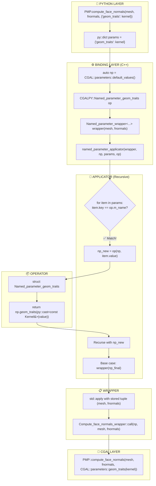
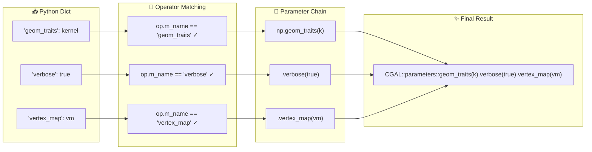
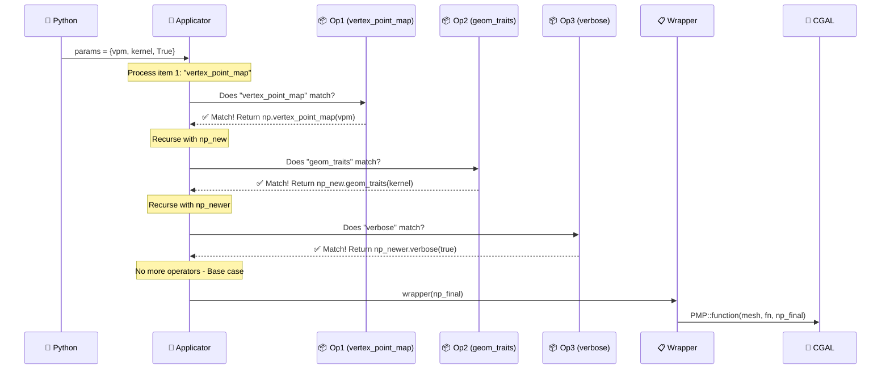
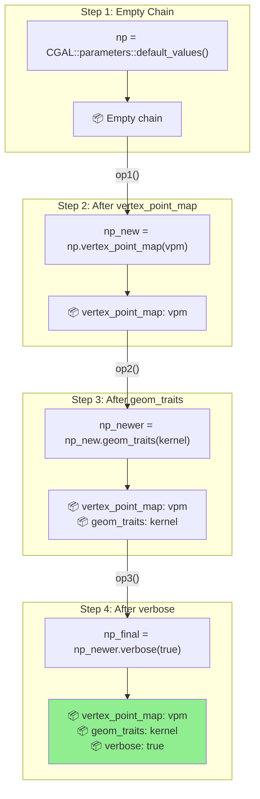
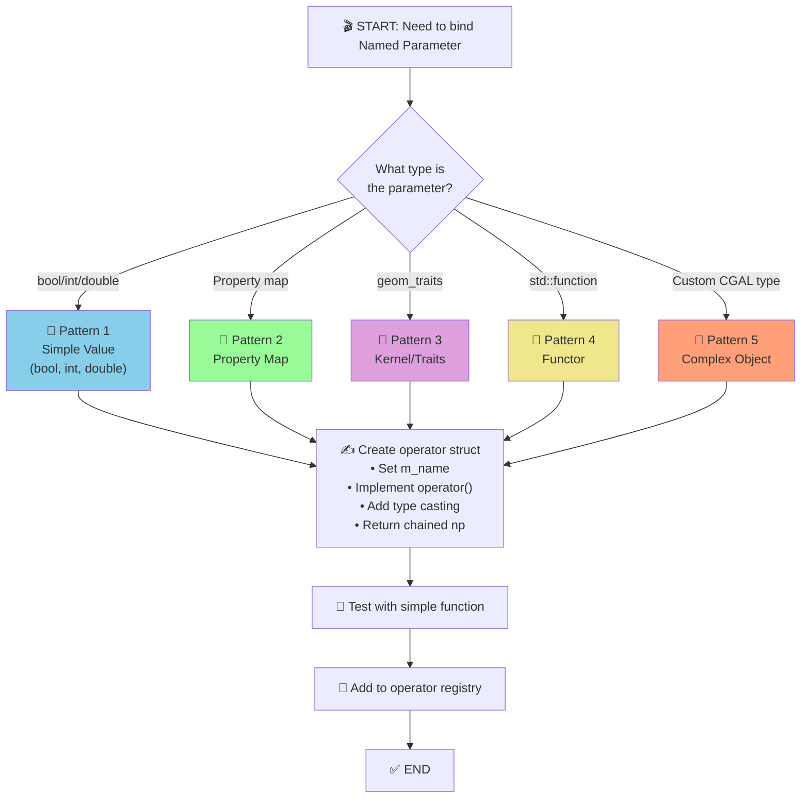
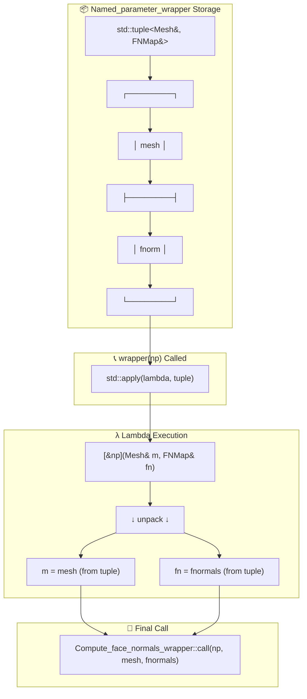
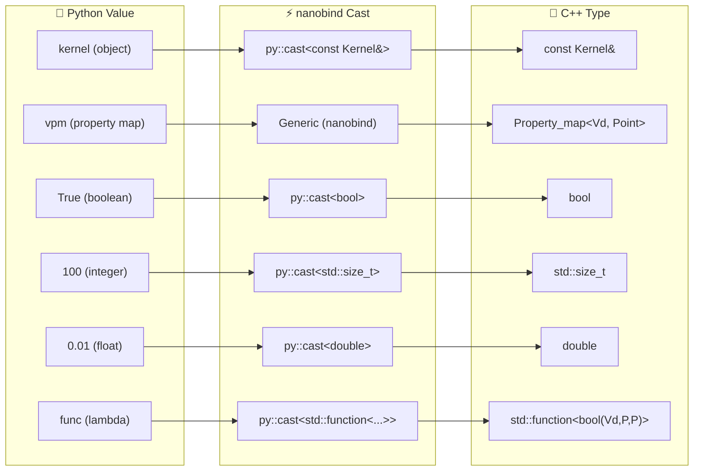
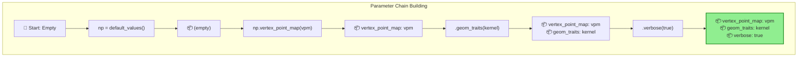
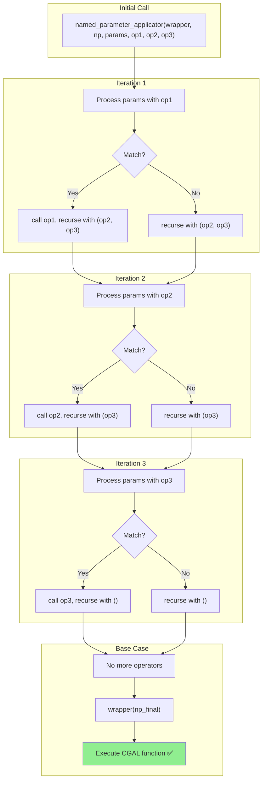

# 🏗️ Named Parameters Architecture — Visual Documentation

**Date:** January 17, 2026  
**Purpose:** Visual explanations of the CGAL Named Parameters system flow  
**Author:** Utkarsh Khajuria

---

## 📋 Table of Contents

- [Architecture Overview](#-architecture-overview)
- [Data Flow Diagram](#-data-flow-diagram)
- [Multi-Parameter Processing](#-multi-parameter-processing)
- [Operator Pattern Flowchart](#-operator-pattern-flowchart)
- [Wrapper std::apply Visualization](#-wrapper-stdapply-visualization)
- [Type Casting Flow](#-type-casting-flow)
- [Parameter Chaining](#-parameter-chaining)
- [Complete Annotated Example](#-complete-annotated-example)

---

## 🔄 Architecture Overview

The Named Parameters system bridges Python dictionaries to CGAL's compile-time parameter chains through a sophisticated multi-layer architecture.

### System Flow Diagram



---

## 📊 Data Flow Diagram

### How Python Dict Becomes CGAL Parameters



---

## 🔢 Multi-Parameter Processing

When a Python call includes multiple parameters, the applicator processes each one recursively:

### Step-by-Step Processing



### Parameter Chain Building



> **Note:** This is compile-time chaining! Each `.parameter()` call returns a new type with that parameter baked in.

---

## 🔀 Operator Pattern Flowchart

### Choosing the Right Pattern



---

## 📦 Wrapper std::apply Visualization

The `Named_parameter_wrapper` stores function arguments in a tuple and uses `std::apply` to unpack them:

### Tuple Storage and Unpacking



### Code Flow

```cpp
// wrapper.data contains:
std::tuple<const Mesh&, const FNMap&>(mesh, fnormals)

// When wrapper(np) is called:
return std::apply(
    [&np](const Mesh& mesh, const FNMap& fnormals) {
        //     ↑↑↑↑↑↑↑↑↑↑    ↑↑↑↑↑↑↑↑↑↑↑↑↑↑↑↑↑↑
        //     Unpacked from tuple automatically!
        
        return Compute_face_normals_wrapper::call(
            np,        // Built parameter chain
            mesh,      // From tuple
            fnormals   // From tuple
        );
    },
    std::move(wrapper.data)  // The tuple to unpack
);
```

---

## 🔄 Type Casting Flow

### Python to C++ Type Conversions



---

## 🔗 Parameter Chaining

### Visual Representation



---

## 📚 Variadic Template Recursion

The `named_parameter_applicator` uses variadic templates to process operators recursively:



---

## 📝 Complete Annotated Example

### Full Flow with Code Comments

```cpp
// ═══════════════════════════════════════════════════════════════════
// 🐍 PYTHON CALL
// ═══════════════════════════════════════════════════════════════════
PMP.compute_face_normals(mesh, fnormals, {"geom_traits": kernel})

// ═══════════════════════════════════════════════════════════════════
// ⚙️ C++ BINDING FUNCTION
// ═══════════════════════════════════════════════════════════════════
template <typename Mesh, typename FNMap>
void compute_face_normals(Mesh& m, FNMap& fn, py::dict params) {
  
  // 📌 Step 1: Start with empty parameter chain
  auto np = CGAL::parameters::default_values();
  //   np type: Named_function_parameters<...>
  
  // 📌 Step 2: Create operator for geom_traits parameter
  CGALPY::Named_parameter_geom_traits op;
  //   op.m_name = "geom_traits"
  //   op.operator() will cast value and chain .geom_traits()
  
  // 📌 Step 3: Create wrapper storing function arguments
  CGALPY::Named_parameter_wrapper<
    Compute_face_normals_wrapper,  // Function wrapper template
    const Mesh&,                    // Arg 1 type
    const FNMap&                    // Arg 2 type
  > wrapper(m, fn);
  //   wrapper.data = std::tuple<const Mesh&, const FNMap&>(m, fn)
  
  // 📌 Step 4: Process parameters and execute
  CGALPY::named_parameter_applicator(
    wrapper,    // Stores mesh + fnormals
    np,         // Empty parameter chain
    params,     // {"geom_traits": kernel}
    op          // Operator to try
  );
}

// ═══════════════════════════════════════════════════════════════════
// 🔁 INSIDE APPLICATOR
// ═══════════════════════════════════════════════════════════════════
for (auto& item : params) {
    std::string key = py::cast<std::string>(item.first);
    // key = "geom_traits"
    
    if (key == op.m_name) {  // "geom_traits" == "geom_traits" ✓
        // MATCH! Call operator
        auto np_new = op(np, item.second);
        //   op(np, kernel)
        //   → np.geom_traits(py::cast<const Kernel&>(kernel))
        //   → Returns updated parameter chain
        
        // Recurse with updated chain (no more operators = base case)
        return named_parameter_applicator(wrapper, np_new, params);
    }
}

// ═══════════════════════════════════════════════════════════════════
// 📦 BASE CASE - CALL WRAPPER
// ═══════════════════════════════════════════════════════════════════
return wrapper(np_new);

// ═══════════════════════════════════════════════════════════════════
// 📋 INSIDE WRAPPER.OPERATOR()
// ═══════════════════════════════════════════════════════════════════
return std::apply(
    [&np_new](const Mesh& mesh, const FNMap& fnormals) {
        // Unpack tuple args: mesh, fnormals
        return Compute_face_normals_wrapper::call(
            np_new,    // Parameter chain: .geom_traits(kernel)
            mesh,      // From tuple
            fnormals   // From tuple
        );
    },
    std::move(wrapper.data)  // Move tuple
);

// ═══════════════════════════════════════════════════════════════════
// 🎯 FINAL CGAL CALL
// ═══════════════════════════════════════════════════════════════════
static void call(auto np, const Mesh& m, const FNMap& fn) {
    // Reorder: Named Parameters go LAST for CGAL
    PMP::compute_face_normals(
        m,   // Arg 1
        fn,  // Arg 2  
        np   // Named Parameters (last!)
    );
}

// ✅ CGAL function executes with proper parameters!
PMP::compute_face_normals(
    mesh,
    fnormals,
    CGAL::parameters::geom_traits(kernel)  // Compile-time parameter
);
```

---

## 🎯 Summary

The Named Parameters architecture consists of:

| Component | Purpose | Key Feature |
|-----------|---------|-------------|
| **Python Layer** | Accept dict from user | `{"param": value}` |
| **Binding Layer** | Initialize wrapper + operators | Template setup |
| **Applicator** | Match dict keys to operators | Recursive processing |
| **Operators** | Type-cast and chain parameters | `np.param(value)` |
| **Wrapper** | Store args, call function | `std::apply` magic |
| **CGAL Layer** | Execute algorithm | Compile-time params |

---

**Last Updated:** January 17, 2026  
**Status:** ✅ Architecture fully documented with visual diagrams