# ⚡ Named Parameters — Quick Reference Guide

**For:** GSoC 2026 Weeks 7-8 Implementation  
**Use:** Quick lookup during coding — no need to read 3500-line analysis

---

## 🚀 The Pattern (30-Second Overview)

```mermaid
flowchart LR
    A["🐍 Python: {'param_name': value}"]
    B["📦 Operator: m_name matches"]
    C["🔄 Cast: py::cast<CppType>"]
    D["🔗 Chain: np.param_name(...)"]
    E["🎯 CGAL: function(args..., np)"]
    
    A --> B --> C --> D --> E
```



---

## 📝 Creating a New Operator (5 Steps)

### Step 1: Create File

```bash
touch include/CGALPY/operators/Named_parameter_PARAM_NAME.hpp
```

### Step 2: Copy Template

```cpp
#ifndef CGALPY_NAMED_PARAMETER_PARAM_NAME_HPP
#define CGALPY_NAMED_PARAMETER_PARAM_NAME_HPP

#include <string>
#include <nanobind/nanobind.h>

namespace py = nanobind;
namespace CGALPY {

struct Named_parameter_PARAM_NAME {
  const std::string m_name = "param_name";  // Python dict key
  
  template <typename NamedParameters, typename Value>
  auto operator()(NamedParameters& np, Value& value) const {
    auto cpp_val = py::cast<CppType>(value);  // Cast to C++ type
    return np.param_name(cpp_val);            // Chain parameter
  }
};

}
#endif
```

### Step 3: Identify C++ Type

Check CGAL documentation or existing code:

| Type | Example |
|------|---------|
| Property maps | `Mesh::Property_map<Descriptor, ValueType>` |
| Primitives | `bool`, `int`, `double`, `std::size_t` |
| Complex | `std::function<...>`, `Visitor`, etc. |

### Step 4: Test with Simple Function

```cpp
void test_binding(Mesh& m, const py::dict& params) {
  auto np = CGAL::parameters::default_values();
  CGALPY::Named_parameter_PARAM_NAME op;
  // ... use with applicator
}
```

### Step 5: Add to Registry

Document in `operator_registry.md`

---

## 📋 Operator Priority List (20 Total)

### Tier 1 — Critical (Days 1-3)

| # | Operator | Type |
|---|----------|------|
| 1 | `vertex_point_map` | `Property_map<Vd, Point_3>` |
| 2 | `vertex_normal_map` | `Property_map<Vd, Vector_3>` |
| 3 | `face_index_map` | `Property_map<Fd, size_t>` |
| 4 | `vertex_index_map` | `Property_map<Vd, size_t>` |
| 5 | `geom_traits` | ✅ DONE |

### Tier 2 — High (Days 4-6)

| # | Operator | Type |
|---|----------|------|
| 6 | `edge_is_constrained_map` | `Property_map<Ed, bool>` |
| 7 | `vertex_is_constrained_map` | `Property_map<Vd, bool>` |
| 8 | `halfedge_index_map` | `Property_map<Hd, size_t>` |
| 9 | `edge_index_map` | `Property_map<Ed, size_t>` |
| 10 | `face_patch_map` | `Property_map<Fd, size_t>` |

### Tier 3 — Medium (Days 7-9)

| # | Operator | Type |
|---|----------|------|
| 11 | `vertex_mean_curvature_map` | `Property_map<Vd, FT>` |
| 12 | `point_to_vertex_map` | `Property_map<Point, Vd>` |
| 13 | `vertex_incident_patches_map` | `Property_map<Vd, int>` |
| 14 | `face_normal_map` | `Property_map<Fd, Vector_3>` |
| 15 | `allow_move_functor` | ✅ DONE |

### Tier 4 — Low (Days 10+)

| # | Operator | Type |
|---|----------|------|
| 16 | `number_of_iterations` | `int/size_t` |
| 17 | `do_project` | `bool` |
| 18 | `use_safety_constraints` | `bool` |
| 19 | `density_control_factor` | `double` |
| 20 | `relaxation_steps` | `int` |

---

## 🔧 Common Type Patterns

### Property Maps

```cpp
// Surface_mesh
using Vd = Surface_mesh::Vertex_index;
using Vpm = Surface_mesh::Property_map<Vd, Point_3>;

// Polyhedron_3
using Vd = Polyhedron::Vertex_handle;
using Vpm = boost::property_map<Polyhedron, vertex_point_t>::type;
```

### Casting Pattern

```cpp
// For property maps - generic cast
return np.vertex_point_map(value);  // Let nanobind handle type

// For primitives - explicit cast
return np.number_of_iterations(py::cast<std::size_t>(value));

// For booleans
return np.verbose(py::cast<bool>(value));
```

---

## 📦 Function Binding Pattern

### Simple Function (1-2 parameters)

```cpp
template <typename Mesh>
void simple_function(const Mesh& m, const py::dict& params) {
  auto np = CGAL::parameters::default_values();
  CGALPY::Named_parameter_geom_traits op1;
  
  CGALPY::Named_parameter_wrapper<Simple_wrapper, const Mesh&> 
    wrapper(m);
  
  CGALPY::named_parameter_applicator(wrapper, np, params, op1);
}
```

### Complex Function (5+ parameters)

```cpp
template <typename Mesh>
void complex_function(const Mesh& m, const py::dict& params) {
  auto np = CGAL::parameters::default_values();
  
  // List ALL operators for this function's parameters
  CGALPY::Named_parameter_vertex_point_map op1;
  CGALPY::Named_parameter_vertex_normal_map op2;
  CGALPY::Named_parameter_geom_traits op3;
  CGALPY::Named_parameter_number_of_iterations op4;
  CGALPY::Named_parameter_verbose op5;
  
  CGALPY::Named_parameter_wrapper<Complex_wrapper, const Mesh&> 
    wrapper(m);
  
  // Pass ALL operators
  CGALPY::named_parameter_applicator(wrapper, np, params, 
                                      op1, op2, op3, op4, op5);
}
```

### Wrapper Template

```cpp
template <typename T, typename... Args>
struct Function_name_wrapper {
  static auto call(T np, Args&&... args) {
    // Reorder: Named Parameters LAST for CGAL
    return CGAL::function_name(std::forward<Args>(args)..., 
                               std::forward<T>(np));
  }
};
```

### Python Binding

```cpp
m.def("function_name", &function_binding<Pm>,
      py::arg("mesh"), 
      py::arg("np") = py::dict());
```

---

## 🧪 Testing Pattern

### Operator Test

```python
def test_operator_param_name():
    mesh = create_mesh()
    value = get_param_value()
    
    result = PMP.function(mesh, {"param_name": value})
    assert result is not None
```

### Chaining Test

```python
def test_multiple_params():
    result = PMP.function(mesh, {
        "vertex_point_map": mesh.points(),
        "geom_traits": kernel,
        "verbose": True
    })
    assert result is not None
```

---

## ⚠️ Common Errors & Fixes

| Error | Cause | Fix |
|-------|-------|-----|
| `py::cast failed` | Wrong C++ type in operator | Check CGAL docs, verify property map type |
| `no matching function for call` | Wrong parameter name or wrapper signature | Check CGAL function signature exactly |
| Segfault when using parameter | Lifetime issue with property map | Use `nb::keep_alive` or verify validity |
| Parameter silently ignored | Operator `m_name` doesn't match dict key | Check spelling, case-sensitivity |

---

## 📁 File Locations (Quick Navigation)

```
Core System:
  include/CGALPY/named_parameter_applicator.hpp
  include/CGALPY/Named_parameter_wrapper.hpp
  
Existing Operators:
  include/CGALPY/Named_parameter_geom_traits.hpp
  include/CGALPY/Named_parameter_verbose.hpp
  include/CGALPY/Named_parameter_repair_polygon_soup.hpp
  
New Operators (create here):
  include/CGALPY/operators/Named_parameter_*.hpp
  
Example Binding:
  src/libs/cgalpy/lib/export_pmp_normal_computation.cpp
  
Legacy System:
  include/CGALPY/pmp_np_parser.hpp (being replaced)
```

---

## ✅ Operator Checklist (Per Operator — 30-40 min)

- [ ] Create `.hpp` file with correct naming
- [ ] Write operator struct with `m_name`
- [ ] Implement `operator()` with correct casting
- [ ] Add inline documentation comments
- [ ] Compile check (no errors/warnings)
- [ ] Add to operator registry document
- [ ] Test with one existing PMP function
- [ ] Document usage example
- [ ] Commit with clear message

---

## 📅 Daily Goals (Weeks 7-8)

### Week 7

| Day | Goal |
|-----|------|
| 1 | 1 operator (setup) |
| 2 | 4 operators |
| 3 | 5 operators (10 total) |
| 4 | Bind 1st function |
| 5 | 6 operators (16 total) |
| 6 | Bind 2nd function |
| 7 | Review + docs |

### Week 8

| Day | Goal |
|-----|------|
| 8 | 4 operators (20 total) + Function #3 |
| 9 | Functions #4 & #5 |
| 10 | Function #6 (complex) |
| 11 | Function #7 + error handling |
| 12 | Comprehensive testing |
| 13 | Documentation |
| 14 | Final review |

---

## 🔍 When Stuck — Debug Checklist

1. ✅ Check operator `m_name` matches dict key exactly
2. ✅ Verify C++ type in `py::cast<>` is correct
3. ✅ Ensure CGAL parameter name matches (e.g., `vertex_point_map`)
4. ✅ Confirm function wrapper reorders arguments correctly
5. ✅ Test with minimal example first
6. ✅ Check if property map needs to be created first
7. ✅ Look at `geom_traits` operator as reference
8. ✅ Ask Efi if still stuck after 30 min

---

## 💡 Key Reminders

| Rule | Remember |
|------|----------|
| ✅ | ONE operator struct per parameter type |
| ✅ | `m_name` must match Python dict key |
| ✅ | CGAL parameters go **LAST** in function call |
| ✅ | Test incrementally — don't batch 10 operators |
| ✅ | Document as you go — not at end |
| ✅ | Commit frequently with good messages |
| ✅ | Ask Efi early if confused |

---

## ⏱️ Time Estimates

| Task | Time |
|------|------|
| Simple operator (bool, int) | 30 min |
| Property map operator | 45 min |
| Complex operator (functor) | 60-90 min |
| Simple function binding | 2-3 hours |
| Complex function binding | 4-5 hours |
| Testing suite | 3-4 hours |
| Documentation | 2-3 hours |

---

**End of Quick Reference** 🚀