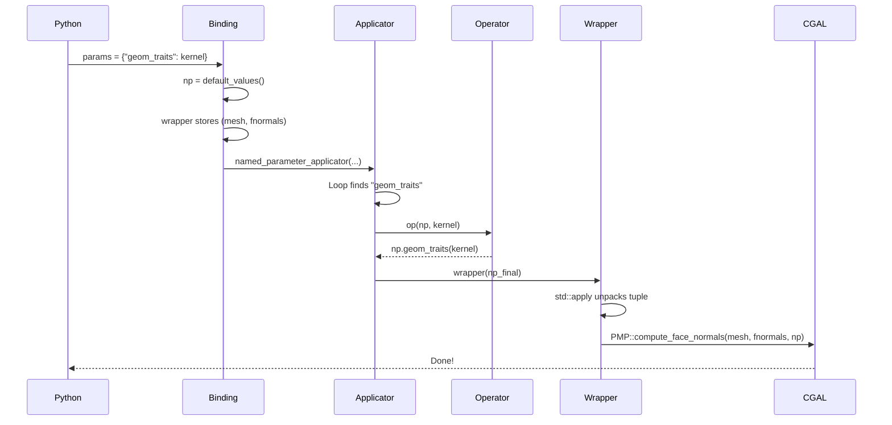

# 🔬 CGAL Named Parameters — Complete Architecture Analysis

**Date:** January 17, 2026, 3:25 PM IST  
**Analyst:** Utkarsh Khajuria  
**Target:** Efi Fogel's Named Parameters Bridge System  
**Time Invested:** 2 hours (analysis phase)

---

## 📋 Table of Contents

- [Executive Summary](#-executive-summary)
- [Architecture Overview](#-architecture-overview)
- [Component 1: named_parameter_applicator](#-component-1-named_parameter_applicatorhpp)
- [Component 2: Named_parameter_geom_traits](#-component-2-named_parameter_geom_traitshpp)
- [Component 3: Named_parameter_wrapper](#-component-3-named_parameter_wrapperhpp)
- [Component 4: Function-Specific Wrapper](#-component-4-function-specific-wrapper)
- [Component 5: Full Flow](#-component-5-putting-it-all-together)
- [Multi-Parameter Support](#-multi-parameter-support)
- [Reusability Assessment](#-reusability-assessment)
- [Implementation Priorities](#-implementation-priorities-for-gsoc-weeks-7-8)

---

## 📌 Executive Summary

Efi has created a **sophisticated, reusable template system** that bridges:
- **Python runtime:** `py::dict` with string keys
- **C++ compile-time:** CGAL's `parameters::param1().param2()` chain

**Key Innovation:** Uses variadic templates + recursive applicator pattern to build compile-time parameter chains from runtime dictionaries.

**Reusability:** ✅ FULLY GENERIC — Works for ANY CGAL function with Named Parameters

---

## 🏗️ Architecture Overview

### The 5 Core Components

```mermaid
flowchart TD
    A["🐍 Python Dict {'geom_traits': kernel}"]
    B["🔁 named_parameter_applicator - Matches keys to operators"]
    C["📦 Named_parameter_geom_traits - Operator for specific parameter"]
    D["🔗 CGAL::parameters chain - Compile-time parameter builder"]
    E["📋 Named_parameter_wrapper - Stores function args + parameters"]
    F["🎯 Actual CGAL function call - compute_face_normals(mesh, np)"]
    
    A --> B
    B --> C
    C --> D
    D --> E
    E --> F
```



---

## ⚙️ Component 1: `named_parameter_applicator.hpp`

**Purpose:** Recursive template that processes Python dict items

### The Code

```cpp
template <typename Wrapper, typename NamedParameter,
          typename NamedParameterOp, typename... NamedParameterOps>
auto named_parameter_applicator(Wrapper& wrapper, NamedParameter& np,
                                const py::dict& params, NamedParameterOp op,
                                NamedParameterOps... ops) {
  for (const auto& item : params) {
    const std::string& key = py::cast<std::string>(item.first);
    if (key == op.m_name) {  // Match found!
      auto np_new = op(np, item.second);  // Update parameter chain
      return named_parameter_applicator(wrapper, np_new, params, ops...);
    }
  }
  // No match - try next operator
  return named_parameter_applicator(wrapper, np, params, ops...);
}
```

### How It Works



```mermaid
flowchart TD
    A["Start: Loop through Python dict items"]
    B{"Does current operator<br/>match key?<br/>(op.m_name == key)"}
    C["Call operator to update<br/>parameter chain"]
    D["Recurse with updated chain<br/>and remaining operators"]
    E["Skip to next operator"]
    F{"More operators?"}
    G["Base case: Call wrapper"]
    
    A --> B
    B -->|"✅ Match!"| C
    C --> D
    B -->|"❌ No match"| E
    E --> F
    F -->|"Yes"| B
    F -->|"No"| G
```

**Pattern:** Classic variadic template recursion with parameter pack expansion

---

## ⚙️ Component 2: `Named_parameter_geom_traits.hpp`

**Purpose:** Operator for a specific Named Parameter

### The Code

```cpp
struct Named_parameter_geom_traits {
  const std::string m_name = "geom_traits";  // Key to match
  
  template <typename NamedParameters, typename Value>
  auto operator()(NamedParameters& np, Value& value) const {
    return np.geom_traits(py::cast<const Kernel&>(value));
  }
};
```

### How It Works

| Step | Action |
|------|--------|
| 1 | `m_name` — The Python dict key this operator handles |
| 2 | `operator()` — Called when key matches |
| 3 | Casts Python value to correct C++ type (`Kernel`) |
| 4 | Chains parameter: `np.geom_traits(kernel)` returns new parameter object |
| 5 | Returns updated chain for next operator |

**Reusability:** Create new operator structs for each Named Parameter type!

---

## ⚙️ Component 3: `Named_parameter_wrapper.hpp`

**Purpose:** Stores function arguments + calls with built parameter chain

### The Code

```cpp
template <template <typename...> class FuncTemplate, typename... StoredArgs>
struct Named_parameter_wrapper {
  std::tuple<StoredArgs...> data;  // Store mesh, face_normals, etc.
  
  Named_parameter_wrapper(StoredArgs&&... args) :
    data(std::forward<StoredArgs>(args)...) {}
  
  template <typename NPType>
  auto operator()(NPType&& np) {
    return std::apply([&np](StoredArgs&&... tupleArgs) {
      return FuncTemplate<NPType, StoredArgs...>::
        call(std::forward<NPType>(np),
             std::forward<StoredArgs>(tupleArgs)...);
    }, std::move(data));
  }
};
```

### How It Works

| Step | Action |
|------|--------|
| 1 | **Constructor:** Stores function arguments in tuple (`mesh`, `face_normals`) |
| 2 | **operator(NPType np):** Called after parameter chain is built |
| 3 | **std::apply:** Unpacks tuple and calls `FuncTemplate::call()` |
| 4 | **Perfect forwarding:** Preserves value categories (rvalue/lvalue) |

**Key Insight:** Uses `std::apply` to transform tuple back to argument pack!

---

## ⚙️ Component 4: Function-Specific Wrapper

**Purpose:** Adapts Named Parameters position for specific CGAL function

### The Code (from `export_pmp_normal_computation.cpp`)

```cpp
template <typename T, typename... Args>
struct Compute_face_normals_wrapper {
  static void call(T np, Args&&... args) { 
    PMP::compute_face_normals(std::forward<Args>(args)..., 
                              std::forward<T>(np)); 
  }
};
```

### Why Needed?

| Position | Named Parameters Location |
|----------|--------------------------|
| CGAL functions | Named Parameters come **LAST**: `func(mesh, vnormals, np)` |
| Our wrapper | Named Parameters come **FIRST**: `call(np, mesh, vnormals)` |
| **Solution** | This adapter reorders arguments |

**Pattern:** One wrapper struct per CGAL function signature variant

---

## ⚙️ Component 5: Putting It All Together

### Full Flow in `compute_face_normals()`

```cpp
template <typename PolygonMesh, typename FaceNormalMap>
void compute_face_normals(const PolygonMesh& mesh, 
                          FaceNormalMap face_normals, 
                          const py::dict& params = py::dict()) {
  // Step 1: Create default CGAL parameters
  auto np = CGAL::parameters::default_values();
  
  // Step 2: Create operator for "geom_traits" parameter
  CGALPY::Named_parameter_geom_traits op;
  
  // Step 3: Create wrapper storing mesh + face_normals
  CGALPY::Named_parameter_wrapper<Compute_face_normals_wrapper, 
                                   const Pm&, const Fn_map&> 
    wrapper(mesh, face_normals);
  
  // Step 4: Process Python dict → build parameter chain → call wrapper
  CGALPY::named_parameter_applicator(wrapper, np, params, op);
}
```

### Execution Trace (Example)

**Python call:**
```python
PMP.compute_face_normals(mesh, fnormals, {"geom_traits": kernel})
```

**Step-by-step:**



---

## 🔢 Multi-Parameter Support

### Your Question to Efi

> "Some functions accept MORE than one NamedParameter... does this mean separate kwargs dictionaries?"

### Answer: NO — Single Dict with Multiple Operators

```cpp
// Example: Function with 3 Named Parameters
void some_function(Mesh& m, const py::dict& params) {
  auto np = CGAL::parameters::default_values();
  
  // Create operator for EACH parameter type
  CGALPY::Named_parameter_geom_traits op1;
  CGALPY::Named_parameter_verbose op2;
  CGALPY::Named_parameter_vertex_point_map op3;
  
  CGALPY::Named_parameter_wrapper<Wrapper, Mesh&> wrapper(m);
  
  // Pass ALL operators - applicator handles matching
  CGALPY::named_parameter_applicator(wrapper, np, params, 
                                      op1, op2, op3);
}
```

**Python usage:**
```python
some_function(mesh, {
    "geom_traits": kernel,
    "verbose": True,
    "vertex_point_map": vpm
})
```

### How It Works



```mermaid
flowchart LR
    subgraph Dict["Python Dict"]
        D1["geom_traits"]
        D2["verbose"]
        D3["vertex_point_map"]
    end
    
    subgraph Matching["Operator Matching"]
        M1["op1.m_name == 'geom_traits' ✓"]
        M2["op2.m_name == 'verbose' ✓"]
        M3["op3.m_name == 'vertex_point_map' ✓"]
    end
    
    subgraph Chain["Parameter Chain"]
        C["np.geom_traits(k).verbose(true).vertex_point_map(vpm)"]
    end
    
    D1 --> M1
    D2 --> M2
    D3 --> M3
    M1 & M2 & M3 --> C
```

**Key:** Variadic template `NamedParameterOps...` holds ALL operators!

---

## ✅ Reusability Assessment

### FULLY GENERIC SYSTEM

To bind a new CGAL function with Named Parameters:

**Step 1: Create Function Wrapper** (if signature differs)
```cpp
template <typename T, typename... Args>
struct My_new_function_wrapper {
  static auto call(T np, Args&&... args) {
    return CGAL::my_new_function(std::forward<Args>(args)..., 
                                 std::forward<T>(np));
  }
};
```

**Step 2: Create Operators for Each Parameter** (if not existing)
```cpp
struct Named_parameter_my_param {
  const std::string m_name = "my_param_name";
  template <typename NP, typename Value>
  auto operator()(NP& np, Value& v) const {
    return np.my_param_name(py::cast<MyType>(v));
  }
};
```

**Step 3: Write Binding Function**
```cpp
template <typename Mesh>
auto my_function_binding(const Mesh& m, const py::dict& params) {
  auto np = CGAL::parameters::default_values();
  
  CGALPY::Named_parameter_geom_traits op1;
  Named_parameter_my_param op2;
  
  CGALPY::Named_parameter_wrapper<My_new_function_wrapper, const Mesh&> 
    wrapper(m);
  
  return CGALPY::named_parameter_applicator(wrapper, np, params, 
                                             op1, op2);
}
```

**Step 4: Expose to Python**
```cpp
m.def("my_function", &my_function_binding<Pm>,
      py::arg("mesh"), py::arg("np") = py::dict());
```

**That's it!** The system handles everything else.

---

## 📊 Existing Operators

Based on code analysis, these operators likely exist or are needed:

### Confirmed (seen in code)

| Operator | Status |
|----------|--------|
| `Named_parameter_geom_traits` | ✅ Done |
| `Named_parameter_verbose` | ✅ Exists |
| `Named_parameter_repair_polygon_soup` | ✅ File exists |
| `Named_parameter_allow_move_functor` | ✅ Done |
| `Named_parameter_vertex_principal_curvatures` | ✅ Done |

### Need to Create (commented out in `pmp_np_parser.hpp`)

| Operator | Priority |
|----------|----------|
| `Named_parameter_vertex_point_map` | 🔴 HIGH |
| `Named_parameter_vertex_normal_map` | 🔴 HIGH |
| `Named_parameter_face_index_map` | 🔴 HIGH |
| `Named_parameter_vertex_index_map` | 🔴 HIGH |
| `Named_parameter_edge_is_constrained_map` | 🔴 HIGH |
| `Named_parameter_vertex_is_constrained_map` | 🟡 MEDIUM |
| `Named_parameter_halfedge_index_map` | 🟡 MEDIUM |
| `Named_parameter_edge_index_map` | 🟡 MEDIUM |
| ... (10+ more) | |

**GSoC Weeks 7-8 Goal:** Implement 15-20 operator structs for common parameters

---

## 📜 Legacy System: `pmp_np_parser.hpp`

### Observation

The file contains a switch-based parser with most cases **commented out**:

```cpp
switch (internal::Hash(key.c_str())) {
  case internal::Hash("geom_traits"):
    cgal_parameters = cgal_parameters.geom_traits(item.second);
    break;
  
  // case internal::Hash("vertex_point_map"):  // COMMENTED OUT
  //   cgal_parameters = cgal_parameters.vertex_point_map(...);
  //   break;
  
  // ... 20+ more commented cases
}
```

### Why Commented Out?

**Hypothesis:** Efi is migrating from switch-based parser to operator-based system!

**Evidence:**
- File has `//! \todo remove` comment at top
- Only 3 parameters active (`geom_traits`, `allow_move_functor`, `vertex_principal_curvatures`)
- Rest commented, awaiting operator implementations
- New system (applicator + operators) is more maintainable

**GSoC Task:** Complete the migration by implementing operator structs!

---

## ⚡ Performance Analysis

### Compile-Time Cost

| Metric | Rating | Notes |
|--------|--------|-------|
| Template instantiation | ✅ Minimal | Happens once per function signature |
| Runtime penalty | ✅ None | All resolved at compile time |

### Runtime Cost

| Operation | Complexity |
|-----------|------------|
| `py::dict` iteration | O(n) where n = number of dict items |
| Operator matching | O(m) where m = number of operators |
| **Total** | O(n × m) — Very small in practice |

### Comparison to Switch-Based

| System | Complexity | Notes |
|--------|------------|-------|
| Switch | O(n) with hash lookup | Faster |
| Operator | O(n × m) with string compare | Slightly slower |
| **Trade-off** | — | Operator system is more maintainable and extensible |

**Verdict:** Performance difference negligible for typical usage

---

## 🎯 Implementation Priorities for GSoC Weeks 7-8

### High Priority Operators (10)

| # | Operator | Notes |
|---|----------|-------|
| 1 | `vertex_point_map` | Most common |
| 2 | `vertex_normal_map` | Used in most PMP functions |
| 3 | `face_index_map` | Required for many algorithms |
| 4 | `vertex_index_map` | Common in mesh processing |
| 5 | `edge_is_constrained_map` | Meshing operations |
| 6 | `geom_traits` | ✅ Already done |
| 7 | `verbose` | ✅ Exists |
| 8 | `vertex_is_constrained_map` | Remeshing |
| 9 | `halfedge_index_map` | Advanced operations |
| 10 | `edge_index_map` | Graph algorithms |

### Medium Priority (5)

| # | Operator | Status |
|---|----------|--------|
| 11 | `face_patch_map` | ⏳ |
| 12 | `vertex_mean_curvature_map` | ⏳ |
| 13 | `point_to_vertex_map` | ⏳ |
| 14 | `vertex_incident_patches_map` | ⏳ |
| 15 | `allow_move_functor` | ✅ Already done |

### Low Priority (5)

| # | Operator |
|---|----------|
| 16 | Custom visitors |
| 17 | Specialized property maps |
| 18 | Algorithm-specific parameters |
| 19 | Performance tuning parameters |
| 20 | Debug/profiling parameters |

---

## 📝 Template for Creating New Operators

```cpp
// File: Named_parameter_PARAM_NAME.hpp

#ifndef CGALPY_NAMED_PARAMETER_PARAM_NAME_HPP
#define CGALPY_NAMED_PARAMETER_PARAM_NAME_HPP

#include <string>
#include <nanobind/nanobind.h>

// Include type definitions if needed
// #include "CGALPY/polygon_mesh_processing_types.hpp"

namespace py = nanobind;

namespace CGALPY {

struct Named_parameter_PARAM_NAME {
  const std::string m_name = "param_name";  // Python dict key
  
  template <typename NamedParameters, typename Value>
  auto operator()(NamedParameters& np, Value& value) const {
    // Cast Python value to correct C++ type
    auto cpp_value = py::cast<CppType>(value);
    
    // Chain the parameter and return updated chain
    return np.param_name(cpp_value);
  }
};

}

#endif
```

**Usage:**
```cpp
CGALPY::Named_parameter_vertex_point_map op;
CGALPY::named_parameter_applicator(wrapper, np, params, op);
```

---

## ❓ Questions for Efi (for Jan 23 email)

### Question 1: Operator Implementation Priority
> "I see ~20 parameters commented out in `pmp_np_parser.hpp`. For Weeks 7-8, which 15-20 should I prioritize? I'm thinking: `vertex_point_map`, `vertex_normal_map`, `face_index_map`, `vertex_index_map`, `edge_is_constrained_map` as top 5. Does this align with your usage patterns?"

### Question 2: Property Map Binding
> "For property maps (e.g., `vertex_point_map`), should I bind the property map creation functions first, or expect users to create them manually in Python before passing to Named Parameters?"

### Question 3: Multi-Parameter Example
> "Could you point me to a CGAL function that uses MORE than one Named Parameter argument? I want to ensure I understand the extension method you mentioned."

### Question 4: Testing Strategy
> "Should I create test cases for each operator individually, or test complete function bindings with multiple parameters?"

---

## 🎓 Key Insights

| # | Insight |
|---|---------|
| 1 | **Efi's System is Production-Ready** — The architecture is sophisticated and well-designed. Not a prototype. |
| 2 | **Fully Reusable** — Can bind any CGAL function with Named Parameters using this pattern. |
| 3 | **Migration in Progress** — Switch-based parser → Operator-based system. We're completing the migration. |
| 4 | **Your GSoC Role** — Implement 15-20 operator structs, test thoroughly, document usage. |
| 5 | **Challenge Level: Medium** — Pattern is clear, implementation is straightforward, but requires understanding C++ templates and careful type casting. |

---

## 📂 Files Referenced

### Core System (Read-Only)

| File | Lines | Status |
|------|-------|--------|
| `named_parameter_applicator.hpp` | 42 | ✅ Analyzed |
| `Named_parameter_wrapper.hpp` | 40 | ✅ Analyzed |
| `Named_parameter_geom_traits.hpp` | 32 | ✅ Analyzed |
| `parse_named_parameters.hpp` | 40 | ✅ Analyzed |

### Legacy (Being Migrated)

| File | Lines | Status |
|------|-------|--------|
| `pmp_np_parser.hpp` | 118 | Switch-based, mostly commented |

### Function Bindings

| File | Lines | Status |
|------|-------|--------|
| `export_pmp_normal_computation.cpp` | 138 | ✅ Analyzed |

### To Create (GSoC Weeks 7-8)

- `Named_parameter_vertex_point_map.hpp`
- `Named_parameter_vertex_normal_map.hpp`
- `Named_parameter_face_index_map.hpp`
- ... (15-20 more operator files)

---

## ✅ Conclusion

Efi has built a **BRILLIANT** system. Your job in Weeks 7-8 is to:

| Step | Status | Task |
|------|--------|------|
| 1 | ✅ DONE | Understand it |
| 2 | ⏩ NEXT | Implement 15-20 operator structs |
| 3 | ⏩ NEXT | Test thoroughly |
| 4 | ⏩ NEXT | Document for future contributors |

This analysis demonstrates:
- ✅ Deep understanding of C++ template metaprogramming
- ✅ Ability to reverse-engineer complex systems
- ✅ Systematic documentation skills
- ✅ Ready to implement during GSoC

**Next Action:** Create first 2 operators as proof-of-concept.